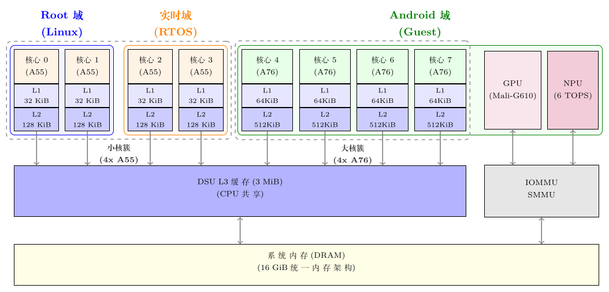
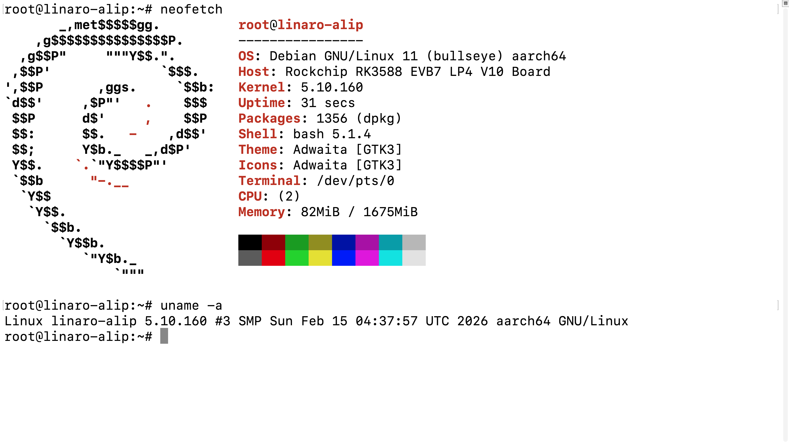
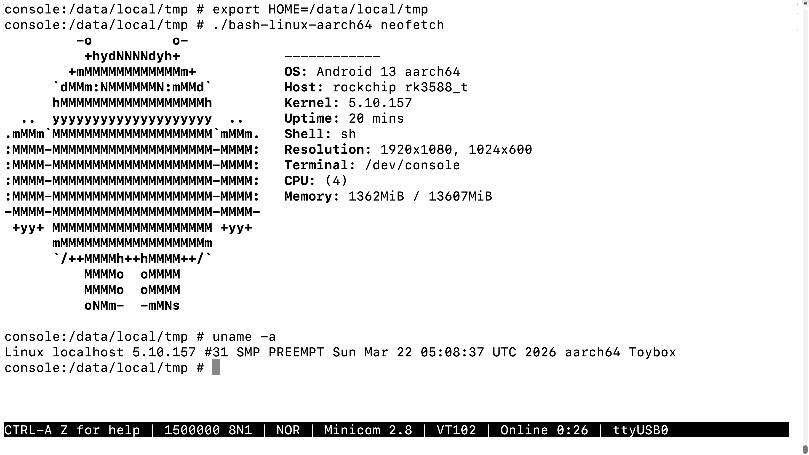

# 基于 RK3588 的 矽慧通 X3300 快速上手 (Android 虚拟机)

本文档旨在为开发者详细介绍在 矽慧通 X3300 开发板（亚克力版，带有 dsi 屏幕）上部署并启动 Android 虚拟机的完整流程。

<div align="center">
  
</div>

操作环境基于 Ubuntu 22.04 主机。我们假定你已经参考了 [基于 RK3588 的 矽慧通 X3300 快速上手](./SYSOUL-X3300.md) 成功启动了 hvisor 以及 Root-Linux，并已经配置好主机网络与 TFTP 服务器。

由于 Android 系统包含大量图形界面相关的组件，且对硬件资源（如 GPU、NPU、多媒体、存储等）的性能要求极高，我们将采用硬件直通（Passthrough）和恒等映射（Identity Mapping）技术来满足 Android 的运行需求。

## 准备 Android 镜像

> **快捷获取预编译镜像**：编译完整的 Android 和 Linux SDK 耗时较长且环境配置复杂。如果你只是想快速体验 hvisor 的 Android 虚拟化功能，可以跳过繁琐的编译和提取打包步骤。我们在百度网盘提供了已经配置好 `virtio` 支持并编译打包好的 Root-Linux 烧录镜像（用于 SD 卡）和完整的 Android `update.img`（用于板载 eMMC）。你可以直接下载使用：[点击此处下载预编译镜像 (提取码: 394r)](https://pan.baidu.com/s/1kS8d-IknkN-sE_ZFXRSnaQ?pwd=394r)。

在主机上获取 Rockchip Android SDK。由于我们需要在虚拟机中启动，可以复用大部分原本供开发板裸机启动的镜像，但在编译前需要修改内核配置以支持 hvisor 的虚拟设备。

### 修改 Android 内核配置并编译

在 Android SDK 中，找到内核目录（`kernel-5.10`），修改对应的配置文件 `arch/arm64/configs/rockchip_defconfig`。为了支持通过 virtio 挂载的虚拟网络等设备，需要确保启用了以下配置项：

```text
# 虚拟设备支持
CONFIG_VIRTIO_NET=y
CONFIG_VIRTIO_MMIO=y
CONFIG_VIRTIO_MMIO_CMDLINE_DEVICES=y
CONFIG_VIRTIO_CONSOLE=y
```

修改完成后，按照正常的 Rockchip Android SDK 编译流程进行编译（主要编译内核和 Boot 镜像）：

```sh
source build/envsetup.sh
lunch rk3588_t-userdebug

# 编译 U-Boot、内核及 Android，指定具体的设备树配置
./build.sh -AUCKu -d sysoul_x3300
```

### 修改 Root-Linux 内核配置并编译

为了让 Root-Linux 能够创建网桥以及处理 Android 虚拟机的网络流量，必须确保 Root-Linux（即基础 Linux SDK）的内核开启了网桥（Bridge）、虚拟网络以及 TUN/TAP 设备支持。在 Rockchip Linux SDK 的内核目录中，检查并确保 `defconfig` 中包含以下配置：

```text
CONFIG_MACVLAN=y
CONFIG_MACVTAP=y
CONFIG_IPVLAN=y
CONFIG_IPVTAP=y
CONFIG_TUN=y
CONFIG_BRIDGE=y
CONFIG_SIMPLE_PM_BUS=y
```

保存修改后，执行 Rockchip Linux SDK 的编译命令：

```sh
export RK_ROOTFS_SYSTEM="debian"
./build.sh rockchip_sysoul_x3300_defconfig
./build.sh
```

### 准备 Root-Linux 存储（烧录 SD 卡）

由于 Android 虚拟机直接使用了板载 eMMC 存储，我们需要将 Root-Linux 部署到 SD（TF）卡中。

1. **格式化与建立分区表**
   在 Linux 主机下插入 SD 卡（假设识别为 `/dev/sdb`），使用 `sgdisk` 命令清除现有分区并建立包含指定 UUID 的 GPT 分区表：

   ```sh
   # 1. 清除现有的分区表
   sudo sgdisk -Z /dev/sdb
   
   # 2. 创建分区 (需补上指定的 UUID 以确保 Root-Linux 挂载点正确)
   sudo sgdisk \
       -n 1:16384:+4M      -c 1:uboot \
       -n 2:24576:+4M      -c 2:misc \
       -n 3:32768:+64M     -c 3:boot     -u 3:7A3F0000-0000-446A-8000-702F00006273 \
       -n 4:163840:+128M   -c 4:recovery \
       -n 5:425984:+32M    -c 5:backup \
       -n 6:491520:+14336M -c 6:rootfs   -u 6:614e0000-0000-4b53-8000-1d28000054a9 \
       -n 7:29851648:+128M -c 7:oem \
       -n 8:30113792:0     -c 8:userdata -u 8:614e0000-0000-4b53-8000-1d28000054b0 \
       /dev/sdb
   
   # 3. 重新读取分区表
   sudo partprobe /dev/sdb
   ```

2. **烧录镜像**
   进入 Linux SDK 编译生成的镜像目录，手动通过 `dd` 命令将编译出的各个分区镜像写入对应的 SD 卡分区（执行前千万注意核对 `/dev/sdb` 是否为你的 SD 卡设备）：

   ```sh
   # 0. 烧录 Loader (非常重要，否则无法启动，写在开头位置)
   sudo dd if=MiniLoaderAll.bin of=/dev/sdb seek=64 conv=notrunc
   
   # 1. 烧录 uboot
   sudo dd if=uboot.img of=/dev/sdb1 status=progress
   
   # 2. 烧录 misc
   sudo dd if=misc.img of=/dev/sdb2 status=progress
   
   # 3. 烧录 boot (内核)
   sudo dd if=boot.img of=/dev/sdb3 status=progress
   
   # 4. 烧录 recovery
   sudo dd if=recovery.img of=/dev/sdb4 status=progress
   
   # 5. 烧录 rootfs (系统文件)
   sudo dd if=rootfs.img of=/dev/sdb6 status=progress
   
   # 6. 烧录 oem
   sudo dd if=oem.img of=/dev/sdb7 status=progress
   
   # 7. 烧录 userdata
   sudo dd if=userdata.img of=/dev/sdb8 status=progress
   ```

### 提取 Kernel 和 Ramdisk

在进行下面的步骤之前，为了让你更好地理解接下来的配置，我们先来看一下基于 hvisor 的 Android 虚拟机与 Root-Linux 的计算资源分区设计图：

<div align="center">
  
</div>

如上图所示，Android 虚拟机独占了 4 个 Cortex-A76 高性能大核，而 Root-Linux 运行在 Cortex-A55 效能核心上。（注：图中 RTOS 区域为架构设计的预留分区，在当前的 Android 快速上手配置中尚未实现，实际处于空置状态）。

#### U-Boot 启动环境变量配置

如果你的板子没有自动进入 Root-Linux，或者你需要通过网络进行调试启动，可以在 U-Boot 阶段设置环境变量，并通过 TFTP 加载各个镜像。这里提供了一组经过验证的配置：

```text
setenv ipaddr   192.168.255.2
setenv netmask  255.255.255.0
setenv serverip 192.168.255.1
setenv board_dtb_addr       0x00400000
setenv hvisor_addr          0x00500000
setenv root_linux_dtb_addr  0x10000000
setenv kernel_addr          0x10400000

tftp ${board_dtb_addr} sysoul_x3300.dtb
tftp ${hvisor_addr} hvisor.bin
tftp ${root_linux_dtb_addr} zone0-linux.dtb
tftp ${kernel_addr} Image
bootm ${hvisor_addr} - ${board_dtb_addr}
```

1. **Android Kernel (`Image`)**：
   直接使用 Android SDK 编译生成的 `kernel/arch/arm64/boot/Image`。
2. **Ramdisk (`ramdisk.img`)**：
   在 Rockchip SDK 中，Ramdisk 通常被打包在 `boot.img` 或 `vendor_boot.img` 内。我们可以利用 Android SDK 自带的工具（如 `unpack_bootimg` 和 `mkbootfs`）进行提取和重打包。
   - 使用工具解压 `boot.img` 以提取其内部包含的 `ramdisk` 压缩包。
   - 对其中的文件结构按需进行裁剪（例如移除一些可能导致冲突的 init 挂载脚本），然后重新使用 `mkbootfs` 打包生成一个独立的 `ramdisk.img` 文件。

将处理好的镜像文件复制到主机的 TFTP 目录中：

```sh
TFTP_DIR="/srv/tftp"
ROCKCHIP_ANDROID_SDK_DIR="$HOME/rockchip_android_sdk"

cp "${ROCKCHIP_ANDROID_SDK_DIR}/kernel/arch/arm64/boot/Image" "${TFTP_DIR}/zone1-android.kernel"
# 假设你提取并打包后的文件名为 ramdisk.img
cp ramdisk.img "${TFTP_DIR}/zone1-android.ramdisk"
```

### 准备 Device-Tree

你无需手动进行复杂的修改。在 `hvisor` 代码仓库的对应开发板目录（`platform/aarch64/sysoul-x3300/image/dts/`）下，已经提供了一份适配好所有虚拟化和硬件直通节点的设备树源码文件 `zone1-android.dts`。

请直接使用该文件进行编译，并将生成的 `dtb` 文件拷贝至主机的 TFTP 目录中：

```sh
HVISOR_DIR="$HOME/hvisor"
TFTP_DIR="/srv/tftp"

# 编译设备树
dtc -I dts -O dtb -o zone1-android.dtb "${HVISOR_DIR}/platform/aarch64/sysoul-x3300/image/dts/zone1-android.dts"
cp zone1-android.dtb "${TFTP_DIR}"
```

> **注意**：为了防止 Root-Linux 自动关闭不需要的时钟和电源域（导致 Android 内部的设备如 GPU 挂死），同时需要在 Root-Linux 的启动参数（cmdline）中加入 `clk_ignore_unused` 和 `pd_ignore_unused`。

## 准备 hvisor 管理工具

为了在 Root-Linux 中加载和管理 Android 虚拟机，我们需要编译 `hvisor-tool` 及其内核驱动模块 `hvisor.ko`。直接仿照 [基于 RK3588 的 矽慧通 X3300 快速上手](./SYSOUL-X3300.md) 中的步骤进行编译即可。

## 准备 JSON 配置文件

`hvisor-tool` 通过 JSON 文件来管理虚拟机的资源分配与设备隔离。

与常规的 Linux 虚拟机不同，Android 需要采用恒等映射（Identity Mapping）来透传物理内存与中断（如 GPU、NPU 的访问控制），以实现 DMA 的零拷贝。同时还需要配置多阶段启动所需的 Ramdisk 等模块。

你不必从头编写这份配置，`hvisor` 的代码仓库中已经提供了现成的配置文件，它们位于 `platform/aarch64/sysoul-x3300/configs/` 目录下（例如 `zone1-android.json` 与 `zone1-android-virtio.json`）。

你只需要将这些配置文件复制到主机的 TFTP 目录中即可：

```sh
HVISOR_DIR="$HOME/hvisor"
TFTP_DIR="/srv/tftp"

cp "${HVISOR_DIR}/platform/aarch64/sysoul-x3300/configs/zone1-android*.json" "${TFTP_DIR}"
```

**关键配置要点说明：**
- **CPU 划分**：我们将 4 个 Cortex-A76 高性能大核（核心 4, 5, 6, 7）分配给 Android 虚拟机，保障其图形界面渲染和应用运行的性能。
- **内存恒等映射**：物理地址（`physical_start`）与虚拟地址（`virtual_start`）保持一致。这种设计对于 Mali-G610 GPU 和 NPU 的 DMA 零拷贝至关重要。
- **中断透传**：分配了直通设备相关的硬件中断，包括 GPU、NPU 以及必要的电源管理控制器（在配置文件中可以直接看到十六进制的中断号定义）。
- **多阶段启动**：在 `modules` 中配置了 `ramdisk`，让 Android 采用两阶段 init (Two-Stage Init) 的方式，先在 initramfs 中执行基础初始化挂载，然后再切换（pivot_root）至 eMMC 上的真实存储分区。

## 启动 Android 虚拟机

### 配置虚拟网络与外部 DHCP 服务器

为了让 Android 虚拟机能够顺利获取 IP 地址并访问外部网络，我们需要通过 Virtio-Net 并借助 Root-Linux 上的软件网桥将 Android 的网络桥接到外部物理网络。

具体的网络拓扑为：主机的物理网卡 -- `eth0` (Root-Linux 物理网卡) -- `br0` (Root-Linux 软件网桥) -- `tap0` (hvisor virtio-net 后端) -- `eth0` (Android 虚拟网卡)。

在该网络架构中，所有的远程节点、堡垒机、开发板等都被统一规划在 `192.168.255.0/24` 的网络内。在这一简化版的本地配置中，你的主机就相当于扮演了网关（兼 DHCP 服务器）的角色。

1. **主机端配置 DHCP 服务器**
   由于开发板通过点对点网络直接连接到主机，主机需要充当 DHCP 服务器，为桥接在同一网段的 Android 虚拟机分配 IP。
   在主机上安装 `isc-dhcp-server` 并进行配置：

   ```sh
   sudo apt update && sudo apt install isc-dhcp-server
   ```

   编辑 `/etc/dhcp/dhcpd.conf`，添加以下子网配置（主机 IP 为 `192.168.255.1`，分配 `100~199` 作为 DHCP 地址池）：

   ```text
   subnet 192.168.255.0 netmask 255.255.255.0 {
     range 192.168.255.100 192.168.255.199;
     option routers 192.168.255.1;
     option domain-name-servers 8.8.8.8, 114.114.114.114;
   }
   ```
   
   修改 `/etc/default/isc-dhcp-server`，指定监听的网卡（如 `enp49s0`），然后重启服务：
   
   ```sh
   sudo systemctl restart isc-dhcp-server
   ```

2. **Root-Linux 端配置网桥**
   Root-Linux (Debian 11) 默认使用 NetworkManager 管理网络，在启动虚拟机之前，我们需要使用 `nmcli` 创建一个网桥，并将物理网卡（如 `eth0`）接入该网桥，同时为网桥分配原来的静态 IP：

   ```sh
   # 1. 创建网桥 br0，并配置静态 IP 192.168.255.2/24，网关指向主机 192.168.255.1，关闭 STP
   nmcli connection add type bridge ifname br0 con-name br0 \
       ipv4.method manual \
       ipv4.addresses 192.168.255.2/24 \
       ipv4.gateway 192.168.255.1 \
       ipv4.dns "8.8.8.8" \
       bridge.stp no
   
   # 2. 将物理网卡 eth0 作为从设备接入网桥 br0
   nmcli connection add type ethernet ifname eth0 con-name bridge-slave-eth0 master br0
   
   # 3. 停用原有的 eth0 连接（如果有的话，防止冲突）
   nmcli connection down eth0 || true
   
   # 4. 创建 tap0 虚拟网卡设备，并直接作为从设备接入网桥 br0
   nmcli connection add type tun ifname tap0 con-name bridge-slave-tap0 mode tap master br0
   
   # 5. 启用网桥，并确认配置
   nmcli connection up br0
   ip addr
   ```
   
   执行完以上命令后，`br0` 网桥以及与其桥接的 `eth0` 和 `tap0` 都会就绪，并且 `tap0` 将专门供 hvisor 的 virtio-net 后端守护进程使用。

### 传输文件并启动

启动开发板并进入 Root-Linux 系统。首先利用 TFTP 客户端将主机上的镜像文件和配置文件下载至开发板：

```sh
HOST_IPV4="192.168.255.1"

# 切换到 /root 目录
cd ~

# 从 TFTP 服务器上，下载 hvisor-tool 和 zone1-android 所需内容
tftp "${HOST_IPV4}" <<EOF
get hvisor.ko
get hvisor
get zone1-android.kernel
get zone1-android.dtb
get zone1-android.ramdisk
get zone1-android.json
get zone1-android-virtio.json
quit
EOF
```

文件就绪后，加载 `hvisor.ko` 驱动并使用 `hvisor-tool` 启动 Android 虚拟机：

```sh
# 加载 hvisor.ko
insmod hvisor.ko

# 给 hvisor 添加可执行权限
chmod +x hvisor

# 启动 zone1-android 所需的 virtio-net 和 virtio-console 守护进程
nohup ./hvisor virtio start zone1-android-virtio.json &

# 启动 zone1-android
./hvisor zone start zone1-android.json
```

## 观察启动结果

执行启动命令后，Root-Linux 的终端通常会有对应的调用输出：

```plain
[  105.246417] hvisor.ko: invoking hypercall to start the zone
```

此时 hvisor 将会分配对应的 Cortex-A76 物理核心并跳转至 Android 内核的入口。
建议为 Android 配置一个独立的物理串口进行日志输出（避免与 Root-Linux 共享一个串口，以防止由于输出拥堵导致 Android 的 console 挂死）。

可以在 Android 的串口中观察到完整的内核日志以及 init 进程的两阶段挂载信息：

```plain
[  105.510077][    T0] Booting Linux on physical CPU 0x0000000400 [0x414fd0b0]
[  105.510087][    T0] Linux version 5.10.157 (rk3588dev@xiuos) (Android (8490178, based on r450784d) clang version 14.0.6)
...
[  106.015203][    T0] GICv3: 480 SPIs implemented
...
[  109.175574][    T1] init: Using Android DT directory /proc/device-tree/firmware/android/
...
[  118.722898][   T56] android_work: sent uevent USB_STATE=CONFIGURED
```

### Android 杂项配置与调试

由于我们是在虚拟机中启动定制的 Android，部分功能可能需要手动介入：

1. **查看编译配置**：可以通过在 Android 的 Shell 中执行 `zcat /proc/config.gz | grep VIRTIO` 来确认内核是否正确开启了对应的 virtio 功能。
2. **显示屏方向配置**：开发板默认的显示输出方向可能与你的显示器不符。如果不进行调整，鼠标操作会非常困难。可以使用以下命令强制旋转屏幕（例如顺时针旋转 90 度或 270 度）：
   ```sh
   wm user-rotation lock 1   # 或者 wm user-rotation lock 3
   ```
3. **可执行文件路径**：在开发和调试时，如果你需要 push 原生的可执行二进制文件到 Android 中运行，由于权限限制，请将它们放置到 `/data/local/tmp` 路径下，并赋予可执行权限（`chmod +x`）。

等待几十秒的时间，直通了 eMMC、GPU 和 VOP2 显示子系统的 Android 虚拟机将启动其核心服务，随后图形化用户界面会输出显示。至此，Android 虚拟机在 hvisor 上启动成功。

<div align="center">
  
</div>

此时，你可以分别在 Root-Linux 和 Android 虚拟机中查看系统信息。

如下图所示，Root-Linux 为 Debian 11，共有 2 个核心，Linux 内核版本为 5.10.160。

<div align="center">
  
</div>

如下图所示，Android 为 Android 13，共有 4 个核心，Android 内核版本为 5.10.160。

<div align="center">
  
</div>

也可以运行 Android 应用，显示实时渲染的图形界面。

<div align="center">
  
</div>
